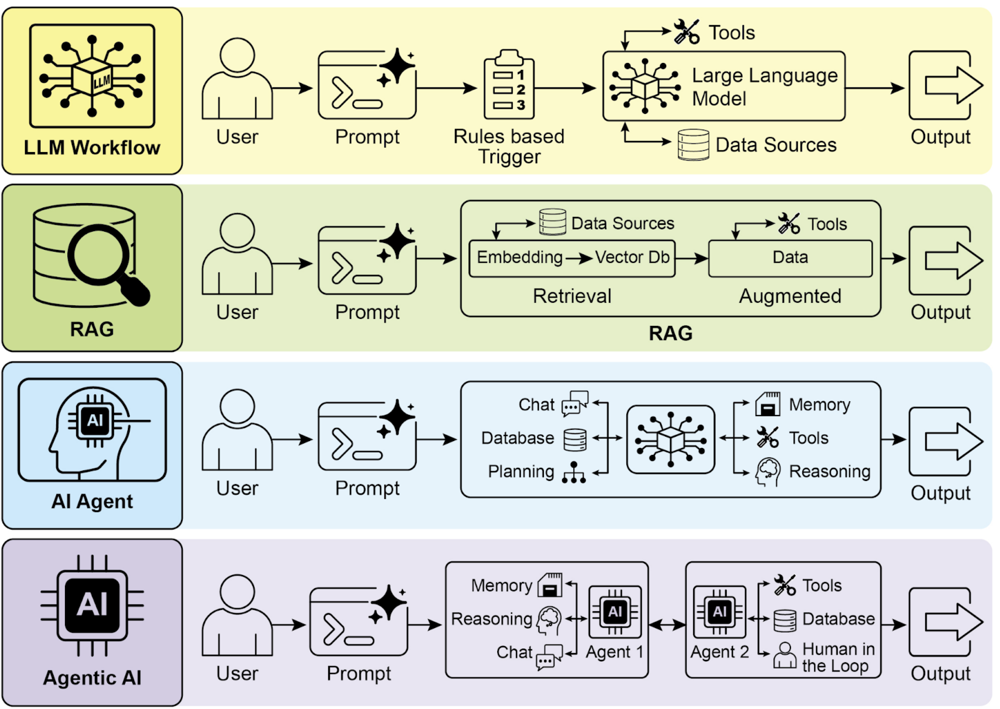

# Agentic Patterns
Agentic patterns involve using language models to perform tasks that require reasoning, planning, and decision-making. These patterns can be used to build intelligent agents that can interact with users, perform complex tasks, and adapt to changing environments.

## Start the notebooks
- [1. Prompt Chaining](./1-PromptChaining.ipynb)
- [2. Routing](./2-Routing.ipynb)
- [3. Parallelization](./3-Parallelization.ipynb)
- [4. Reflection](./4-Reflection.ipynb)
- [5. Tool Use](./5-ToolUse.ipynb)
- [6. Planning](./6-Planning.ipynb)
- [7. Multi-Agent](./7-Multi-Agent.ipynb)
- [8. Memory Management](./8-Memory-Management.ipynb)
- [9. Learning and Adaptation](./9-Learning-Adaptation.ipynb)
- [10. Model Context Protocol - MCP](./10-Model-Context-Protocol.ipynb)
- [11. Goal Setting and Monitoring](./11-GoalSetting-Monitoring.ipynb)
- [12. Exception Handling and Recovery](./12-Exception-Handling.ipynb)
- [13. Human-in-the-Loop - HITL](./13-Human-in-the-Loop.ipynb)
- [14. Knowledge Retrieval - RAG](./14-RAG.ipynb)
- [15. Inter-Agent Communication - A2A](./15-A2A.ipynb)
- [16. Resource-Aware Optimization](./16-Resource-Aware.ipynb)
- [17. Reasoning Techniques](./17-Reasoning-Techniques.ipynb)
- [18. Guardrails/Safety Patterns](./18-Guardrails.ipynb)
- [19. Evaluation and Monitoring](./19-Evaluation.ipynb)
- [20. Prioritization](./20-Prioritization.ipynb)
- [21. Exploration and Discovery](./21-Discovery.ipynb)

      