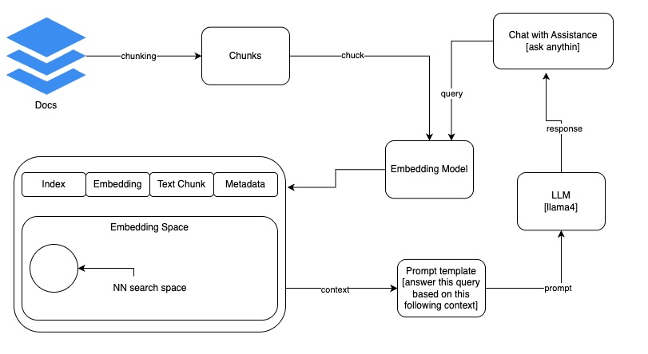

# Retrieval Augmented Generation (RAG)

## RAG
RAG is a technique in natural language processing (NLP) that combines information retrieval and generative models to produce more accurate, relevant, and contextually aware responses. 

## What is RAG?
One of the most powerful applications enabled by LLMs is sophisticated question-answering (Q&A) chatbots. These are applications that can answer questions about specific source information. These applications use a technique known as retrieval-augmented generation (RAG). RAG is a technique for augmenting LLM knowledge with additional data, which can be your own data.

LLMs can reason about wide-ranging topics, but their knowledge is limited to public data up to the specific point in time that they were trained. If you want to build AI applications that can reason about private data or data introduced after a model’s cut-off date, you must augment the knowledge of the model with the specific information that it needs. The process of bringing and inserting the appropriate information into the model prompt is known as RAG.

LangChain has several components that are designed to help build Q&A applications and RAG applications, more generally.

## RAG architecture
A typical RAG application has two main components:
- Indexing: A pipeline for ingesting and indexing data from a source. This usually happens offline.
    - Load: First, you must load your data. This is done with DocumentLoaders.
    - Split: Text splitters break large Documents into smaller chunks. This is useful both for indexing data and for passing it into a model because large chunks are harder to search and won’t fit in a model’s finite context window.
    - Store: You need somewhere to store and index your splits so that they can later be searched. This is often done using a VectorStore and Embeddings model.
- Retrieval and generation: The actual RAG chain takes the user query at run time and retrieves the relevant data from the index, then passes that to the model.
    - Retrieve: Given a user input, relevant splits are retrieved from storage using a retriever.
    - Generate: A ChatModel / LLM produces an answer using a prompt that includes the question and the retrieved data.

  
