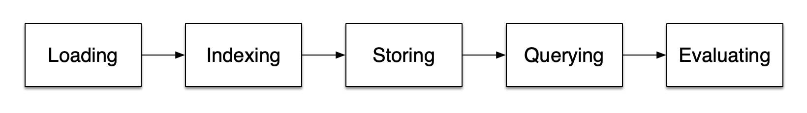
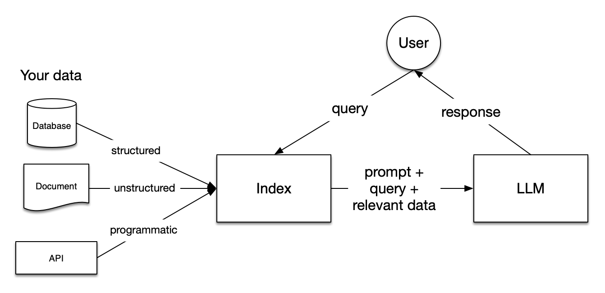
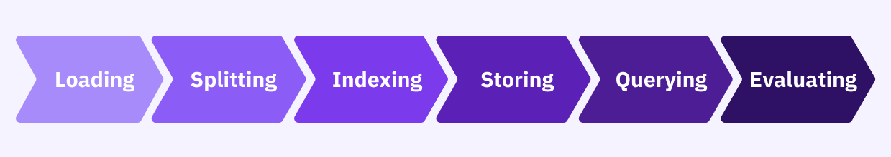

# Retrieval Augmented Generation (RAG)

## RAG
RAG is a technique in natural language processing (NLP) that combines information retrieval and generative models to produce more accurate, relevant, and contextually aware responses. 

## What is RAG?
One of the most powerful applications enabled by LLMs is sophisticated question-answering (Q&A) chatbots. These are applications that can answer questions about specific source information. These applications use a technique known as retrieval-augmented generation (RAG). RAG is a technique for augmenting LLM knowledge with additional data, which can be your own data.

LLMs can reason about wide-ranging topics, but their knowledge is limited to public data up to the specific point in time that they were trained. If you want to build AI applications that can reason about private data or data introduced after a model’s cut-off date, you must augment the knowledge of the model with the specific information that it needs. The process of bringing and inserting the appropriate information into the model prompt is known as RAG.

LangChain has several components that are designed to help build Q&A applications and RAG applications, more generally.

## What is a question-answering agent?
A question-answering agent is a type of artificial intelligence system that is designed to generate responses to questions. It is typically based on an LLM that is trained on a variety of language tasks. Question-answering agents are used in a wide range of applications, including chatbots, search engines, and virtual assistants.

## RAG architecture
A typical RAG application has two main components:
- Indexing: A pipeline for ingesting and indexing data from a source. This usually happens offline.
    - Load: First, you must load your data. This is done with DocumentLoaders.
    - Split: Text splitters break large Documents into smaller chunks. This is useful both for indexing data and for passing it into a model because large chunks are harder to search and won’t fit in a model’s finite context window.
    - Store: You need somewhere to store and index your splits so that they can later be searched. This is often done using a VectorStore and Embeddings model.
- Retrieval and generation: The actual RAG chain takes the user query at run time and retrieves the relevant data from the index, then passes that to the model.
    - Retrieve: Given a user input, relevant splits are retrieved from storage using a retriever.
    - Generate: A ChatModel / LLM produces an answer using a prompt that includes the question and the retrieved data.

## RAG Stages
Within the RAG framework, there are five key stages, though in this lab, we'll focus on the first four. These stages are fundamental to most larger applications you might develop. The stages include:

- Loading: This involves bringing your data into your workflow, regardless of its source—be it text files, PDFs, websites, databases, or APIs. LlamaHub offers a wide array of connectors to facilitate this process.
- Indexing: This stage involves creating a data structure that enables efficient querying. For LLMs, this typically involves generating vector embeddings, which are numerical representations that capture the meaning of your data, along with various metadata strategies to ensure accurate and contextually relevant data retrieval.
- Storing: After indexing, it's usually important to save your index along with associated metadata to avoid the need for re-indexing in the future.
- Querying: Depending on your indexing strategy, there are multiple ways to utilize LLMs and LlamaIndex data structures for querying. This can include sub-queries, multi-step queries, and hybrid approaches.
- Evaluation: An essential stage in any workflow is evaluating how effective your approach is compared to others or when adjustments are made. Evaluation offers objective metrics to assess the accuracy, fidelity, and speed of your query responses.

## Start the notebooks
- [RAG system for web data using ollama service with VectorDB](./RAGForWebPageUsingOllamaWithVectorDB.ipynb)
- [Summarize private docs 'Txt' with Ollama using LangChain's PromptTemplaten](./RAGforTxtFilesWithOllamaUsingLangChainPromptTemplate.ipynb)
- [RAG system for PDF's using Ollama service with LlamaIndex](./RAGForPdfsUsingOllamaWithLlamaIndex.ipynb)
- [RAG build a grounded Q & A Agent with Ollama service with Langchain](./RAGbuildAroundedQuestionAndAnsAgentWithLangchain.ipynb)

  

  

  

